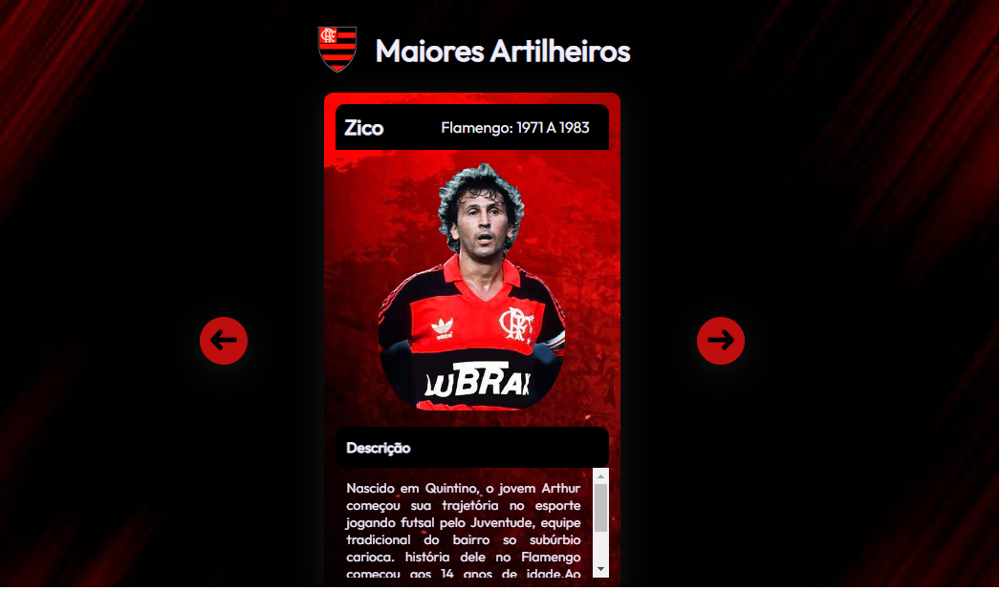

# Projeto criado na semana MapaDev Week

## HTML
- Principais tags
- Tags semânticas
- Links
  - Internos
  - Externos
- Sintaxe

## CSS
- Sintaxe
- Seletores
- Folhas de estilos externas
- Fontes externas
- Responsividade

## Javascript
- Sintaxe
- Variáveis 
- Condicionais
- Funções
- Eventos

https://luizaraujo18.github.io/projeto-mapadev-week/

  
 
  
  
  
  
